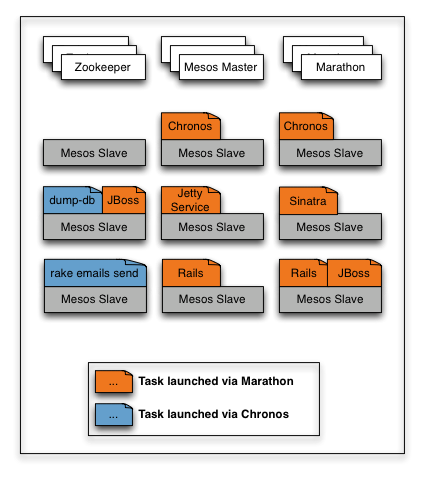
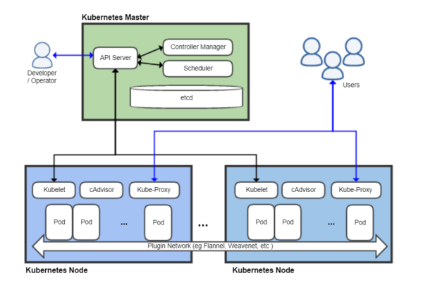

== Orchestration de conteneurs : le choix des armes !
(by Jonathan Raffre , Jean-Louis Rigau , Thomas Auffredou, Yannick lorenzati)

Présentation de Swarm, Mesos & Kubernetes

=== Conteneur ?

* Basé sur noyau linux
* Permet une isolation de processus
* Il existe plusieurs implémentations (docker, rkt, etc.)

=> On ne livre plus des applications mais des images

=== Micro Services

Intérêt : mieux gérer la granularité des services pour faciliter le scaling

Conséquences : on doit gérer une multitude de services et la communication entre les services

=> Si trop grand nombre de services, il est nécessaire d'utiliser un orchestrateur de conteneurs

=== Responsabilités de l'Orchestrateur

* Gère un pool de ressources (disque, cpu, etc…)
* Connait la topologie du cluster
* Connait les applications déployées (où, combien ?)
* Connaît l'état de santé des services
* Connaît l'état de santé de la plateforme
** Perte d'un noeud => redéploiement des applications

=== Swarm = Swarm mode de docker

* Node : Docker engine membre du cluster (manager ou worker)
* Stack : ensemble de Services
* Service : ensemble de Tasks
* Task : un conteneur

=== Mesos - Marathon (2 projets)

* Mesos Master : connait les ressources et orchestre les taches
* Mesos Agent : exécute les taches demandées par le master
* Framework : permet d'interagir avec le master (exemple : marathon qui travaille avec les conteneurs)
* Task : processus exécuté sur un agent

=> Supporte d'autres conteneurs (Docker + Mesos containerizer)

=== Architecture

=== Kubernetes

* Master : ensemble des composants nécessaires à la gestion du cluster
* Node : exécute les pods
* Pod : ensemble de conteneurs colocalisés

=== Architecture

